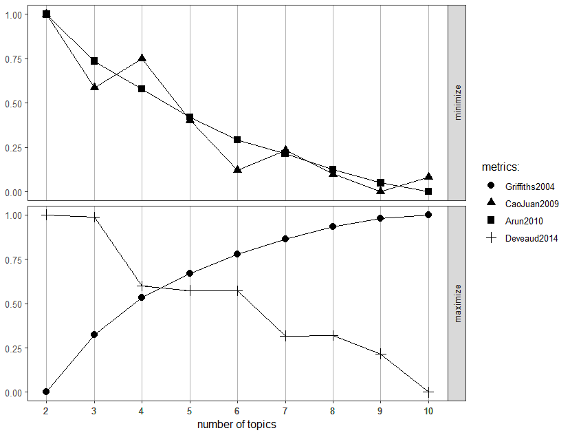
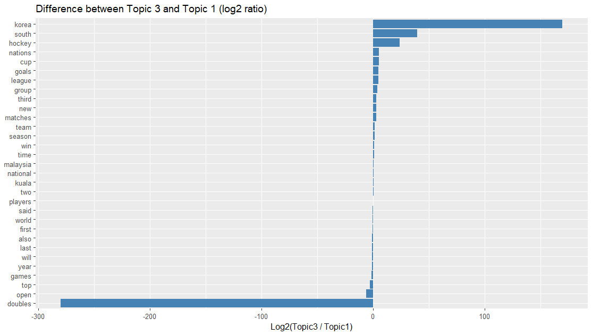

# 📰 Malaysia Sports News Text Analysis

  

---

## 📌 Overview

This project applies **topic modeling**, **sentiment analysis**, and **TF-IDF term extraction** to a corpus of 120 Malaysia sports news articles written in English, sourced from *New Straits Times (NST)* and *The Star (Malaysia)*. The goal is to uncover key topics, emotional tones, and term patterns to better understand how Malaysian sports are represented in the media.

---

## 📘 Objectives

- Discover dominant themes using **LDA Topic Modeling**
- Evaluate topic coherence for different topic counts (k = 3 vs k = 6)
- Perform sentiment analysis using **Bing** and **NRC** lexicons
- Extract **TF-IDF** terms to highlight unique keywords
- Visualize how documents are distributed across topics using **Gamma values**

---

## 🧪 Methodology

1. Collected 120 English sport articles (May-June,2025)
2. Preprocessing: lowercase conversion, stopword removal, punctuation cleaning, and lemmatization
3. Constructed Document-Term Matrix (DTM)
4. Applied **Latent Dirichlet Allocation (LDA)** using Gibbs Sampling
5. Evaluated topic coherence with `ldatuning` package
6. Visualized per-topic term probabilities (beta) and document proportions (gamma)
7. Performed **Bing** and **NRC** sentiment analysis
8. Applied **TF-IDF** to find unique document-level terms

---

## 🔍 LDA Tuning Results

**Discussion**:  
Multiple topic coherence metrics were used to determine the optimal number of topics. The Deveaud2014 and Griffiths2004 scores indicated that **k = 6** provides better topic separation and interpretability compared to lower k values.

---

## 📌 Top 10 Terms per Topic

### k = 3

**Discussion**:  
With only 3 topics, broader themes are captured. For example, Topic 1 combines international sports, Topic 2 focuses on team-based games, and Topic 3 captures performance or seasonal insights. However, topic boundaries are less distinct.

---

### k = 6

**Discussion**:  
The k = 6 model shows **clearer topic separation**. For instance, Topic 1 is about **badminton**, Topic 3 about **cycling**, Topic 4 about **football**, and Topic 5 captures **international hockey**. Each topic focuses on specific sports or issues like injuries, match performance, or global competitions.

---

## 📉 Beta Log-Ratio Comparison Between Topics

### 🔹 k = 3: Topic 3 vs Topic 1  

**Discussion**:  
This plot visualizes the **log2 ratio of per-topic word probabilities** between Topic 3 and Topic 1 in the *k = 3 model*.  
- Words on the right (positive values) are **more probable in Topic 3** (e.g. `cycle`, `race`, `sea`), indicating focus on **cycling or endurance sports**.
- Words on the left (negative values) are **more probable in Topic 1** (e.g. `bam`, `pair`, `tournament`), indicating **badminton**.
- Terms near 0 are **shared** across both topics, such as `national` or `win`.

---

### 🔹 k = 6: Topic 5 vs Topic 1  

**Discussion**:  
In the k = 6 model, this plot compares Topic 5 (likely **hockey or team sports**) against Topic 1 (**badminton**).  
- Positive values (right) highlight words strongly linked to Topic 5, such as `goal`, `match`, `minutes`, and `Pakistan`.
- Negative values (left) show badminton-centric terms for Topic 1 like `bam`, `badminton`, and `open`.
- This analysis demonstrates clearer separation between sports in the k = 6 model.

---

## ❤️ Bing Sentiment Analysis

**Discussion**:  
All topics show higher positive sentiment than negative. Topics like double pair wins in badminton and local tournaments carry optimistic tone. Topics discussing injuries (e.g., Topic 2 in k=6) had slightly more balanced or neutral tones.

---

## 😃 NRC Emotion Analysis

**Discussion**:  
Positive emotions like **trust**, **anticipation**, and **joy** dominate. Negative emotions like **anger** or **fear** are minimal and mostly linked to injury-related topics. Topic 3 in both models consistently shows high positive emotion, indicating uplifting sports narratives.

---

## 🏷️ TF-IDF Top Terms by Topic

**Discussion**:  
TF-IDF analysis highlights **document-specific keywords**. Names like “Razif”, “Sidek” and “Iskandar” appear in athlete-focused articles. Terms like “Selangor” or “Homebois” indicate team-related coverage. This method complements topic modeling by surfacing unique language patterns.

---

## 📊 Topic Proportions per Document (Gamma)

**Discussion**:  
Gamma values show most documents align strongly with a **single dominant topic** (values close to 1). This suggests the LDA model produces **coherent, non-overlapping topics**, especially in the k = 6 model.

---

## ✅ Conclusion

Both topic models offer valuable insights, but the **k = 6 model is more interpretable**, providing **better separation between sports themes** such as badminton, cycling, football and injuries. Gamma values further illustrated strong topic alignment per document. **TF-IDF terms** helped highlight distinct terms within each topic. Sentiment analysis confirmed a generally positive tone across Malaysian sports news, supporting national pride and motivation.

---

## 👨‍🎓 Author 

**Author:** Azrul Zulhilmi Ahmad Rosli  

---
